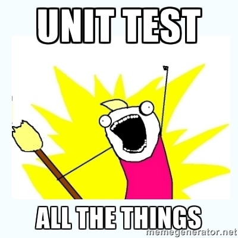
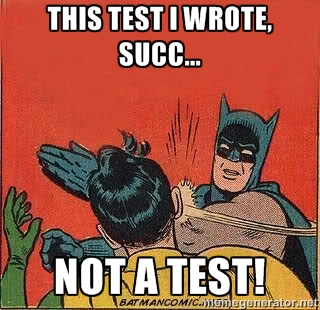

footer: © Tim Steinbach, 2014
slidenumbers: true

# Testing

### Unit tests, micro benchmarks and friends

###### [Tim Steinbach](https://twitter.com/Tim_Steinbach)

---

# Types

### Unit tests

"Unit testing is a software testing method by which individual units of source code [...] are tested to determine if they are fit for use. Intuitively, one can view a unit as the smallest testable part of an application" <br />([Wikipedia](https://en.wikipedia.org/wiki/Unit_testing))



---

# Types

### Benchmarks

"Benchmarking is used to measure performance" <br />([Wikipedia](https://en.wikipedia.org/wiki/Benchmarking))


---

# Types

### Micro Benchmarks

Like a unit test but testing performance rather than correctness


---

# Unit tests

### JUnit

JUnit is a simple framework to write repeatable tests. It is an instance of the xUnit architecture for unit testing frameworks.

<http://junit.org/>

---

# JUnit

### Good unit test (1)

```java
  @Test
  public void contains_emptyString() {
    assertTrue("Hello World".contains(""));
  }
```

---

# JUnit

### Good unit test (2)

```java
  @Test
  public void sum_10to100() {
    IntStream stream = IntStream.range(10, 100);
    int expected = 4905;

    assertEquals(expected, stream.sum());
  }
```

---

# JUnit

### Good unit test (3)

```java
  @Test(expected = NullPointerException.class)
  public void put_nullKey() {
    HashMap<String, String> map = new HashMap<>();
    map.put(null, "FooBar");
  }
```

---

# JUnit

### Bad unit test (1)

```java
  @Test
  public void put_nullKey_bad() {
    HashMap<String, String> map = new HashMap<>();
    try {
      map.put(null, "FooBar");
      Assert.fail();
    } catch (NullPointerException e) {
      // Succeed if NPE was caught
    }
  }
```

---

# JUnit

### Bad unit test (2)

```java
  @Test
  public void testOptional() {
    Optional<Long> o1 = Database.loadOptional();
    assertTrue(o1.isPresent());
    Optional<Long> o2 = o1.map(x -> x * 10L + 4L);
    assertEquals(1234L, o2.get());
    Optional<String> o3 = o2.flatMap(x -> Optional.ofNullable(x.toString()));
    assertTrue(o3.isPresent());
  }
```

---

# JUnit

### Horrifyingly awkward test (1)

```java
  private static final List<Integer> TEST_LIST = ...

  @Test
  public testSum() {
    ...

    for (int i = 0; i < 100000; i++) {
      assertEquals(12345, sum(TEST_LIST));
    }

    ...
  }
```

---

# JUnit

### Horrifyingly awkward test (2)

```java
  private static final List<Integer> TEST_LIST = ...

  @Test
  public testSum() {
    long start = System.currentTimeMillis();

    for (int i = 0; i < 100000; i++) {
      assertEquals(12345, sum(TEST_LIST));
    }

    long finish = System.currentTimeMillis();
    ...
  }
```

---

# JUnit

### Horrifyingly awkward test (3)

```java
  private static final List<Integer> TEST_LIST = ...

  @Test
  public testSum() {
    long start = System.currentTimeMillis();

    for (int i = 0; i < 100000; i++) {
      assertEquals(12345, sum(TEST_LIST));
    }

    long finish = System.currentTimeMillis();
    assertTrue((finish - start) < 80000L);
    System.out.println("Test took " + (finish - start) + " ms");
  }
```


---

# JUnit

### Horrifyingly awkward test (4)

```java
  private static final List<Integer> TEST_LIST = ...

  @Test
  public testSum() {
    long start = System.currentTimeMillis(); // Don't use S.cTM()

    for (int i = 0; i < 100000; i++) {
      assertEquals(12345, sum(TEST_LIST)); // Don't benchmark assertEquals
    }

    long finish = System.currentTimeMillis();
    assertTrue((finish - start) < 80000L); // Success depends on hardware specs?
    System.out.println("Test took " + (finish - start) + " ms"); // Unit tests shall never print to stdout
  }
```

---

# JUnit

### Micro benchmark

**Demo: ArraySumTest**

---

# Micro benchmarks

### JMH

JMH is a Java harness for building, running, and analysing nano/micro/milli/macro benchmarks written in Java and other languages targetting the JVM.

<http://openjdk.java.net/projects/code-tools/jmh/>

---

# JMH

### Example

```java
  @Benchmark
  public void testMethod(Blackhole bh) {
    bh.consume(method(foo, bar));
  }
```

---

# JMH

### Output

```
# Run progress: 0.00% complete, ETA 00:01:00
# Fork: 1 of 2
# Warmup Iteration   1: 1.164 ms/op
# Warmup Iteration   2: 1.115 ms/op
# Warmup Iteration   3: 1.099 ms/op
# Warmup Iteration   4: 1.103 ms/op
# Warmup Iteration   5: 1.102 ms/op
Iteration   1: 1.083 ms/op
Iteration   2: 1.097 ms/op
Iteration   3: 1.094 ms/op
Iteration   4: 1.083 ms/op
Iteration   5: 1.075 ms/op
```

---

# JMH

**Demo: ArraySumBench**

---

# JMH

**Demo: MapBench**

---

# Bonus

---

JUnit 3 vs 4


---

# JUnit 3 vs 4

### JUnit 3

```java
  public class MyTest extends TestCase {
    public void setUp() throws Exception {...}
    public void tearDown() throws Exception {...}

    public void testFoo() {...} // All tests need to be named testXXX
  }
```

---

# JUnit 3 vs 4

### JUnit 4

```java
  public class MyTest {
    @Before
    public void eachTestSetup() {...}

    @After
    public void eachTestTearDown() {...}

    @BeforeClass
    public void onceSetup() {...}

    @AfterClass
    public void onceTearDown() {...}

    @Test
    public void foo() {...}
  }
```

---

# JUnit 3 vs 4

### JUnit 4 - new features

```java
  @Ignore

  @Test(timeout = 1000)

  @Test(expected = NumberFormatException.class)

  assertEquals(Object[], Object[])
```

---

# How not to test



```java
public class SuperTest {
  public static void main(String[] args) {
    System sys = new System();
    sys.readConfig();
    sys.start();
    Thread.sleep(10_000L);
    if (sys.isStarted()) {
      System.out.println("Success!");
    } else {
      System.out.println("Something is wrong!");
    }
    sys.stop();
  }
}
```

---

JMH: Exceptions

---

# Exceptions

**Demo: ExceptionsBench**

---

# Links

[Picard Facepalm](http://uncyclopedia.wikia.com/wiki/File:Picard-facepalm.jpg)
[Memegenerator](http://memegenerator.net/)
[Microbenchmarking on the JVM with JMH](http://daniel.mitterdorfer.name/talks/2014/jmh-microbenchmarking-munich/#/)
[Test wallpaper](http://www.artwallpaperhi.com/Design/patterns/test_pattern_2560x1600_wallpaper_17600)
