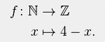

footer: Tim Steinbach, 2015
slidenumbers: true

# Java 8

## Lambdas and Streams

---

# Rules

- If you have questions, wait for a white slide
- Your question may be answered on the way to the next one
- There will be a few "exercises" - If you know the answer, don't spoil it for the others

---

# Are you ready?

## (This is an interactive slide :D)

---

# Lambdas

## What is a lambda expression?

- Concise syntax for function definition
- That's it!

---

# Lambdas

## What does a lambda expression look like?

```java
x -> { doSomething(); }
```

Remember that little thing called "Mathematics"?[^1]



[^1]: <https://en.wikipedia.org/wiki/Function_(mathematics)#Notation>

---

# Lambdas

## Why would I want one?


```java
final Runnable r = new Runnable() {
 @Override public void run() {
   doSomething();
 }
}
```

vs.

```
final Runnable r = () -> doSomething();
```

---

# Lambdas

## So what is a lambda again?

- Non-boilerplate way of defining a function, a method or an anonymous class.
- Single-use

---

# Lambdas

## Some examples

```java
Function<Integer, Integer> f3 = x -> x * 3;
Supplier<String> s = () -> "Hello World";
Consumer<Long> c = c -> System.out.println(c);
```

---

# Function, Supplier, Consumer, WAT?

---

# Lambdas

## Functional interfaces

- Lambdas are a language feature
- Code is transformed at compile time
- Lots of them in java.util.function.*

---

# Lambdas

## Hold on, so what does my lambda turn into?

```java
x -> x * 3;
```

is essentially

```java
new Function<Integer, Integer>() {
  @Override public Integer apply(Integer i) {
    return i * 3;
  }
}
```

---

# Lambdas

## Most common functional interfaces

- Function<T, U>: Turn T into U
- Supplier<T>: Produce T
- Consumer<T>: Consume T

---

# Lambdas

## Compare to methods

```java
x -> x * 2;
() -> 42;
x -> System.out.println(x);
```

```java
Integer double(Integer i) { return i * 2; }
Integer fourtyTwo() { return 42; }
void printInt(Integer i) { System.out.println(i); }
```

---

# Soooo... Lambda all the things?

---

# Lambdas

## Best practices

- Short
- Single-use
- Supposed to make things **MORE** readable!
- No checked exceptions

---

# Lambdas

## Real-world examples (1)

```java
// com.trustwave.siem.analytics.ui.ChooseConfigDbAction
Consumer<Boolean> toggleVisibility = b -> {
    dbChoices.setVisible(!b);
    hostnameEntryField.setVisible(b);
    addressLabel.setVisible(b);
};

final ActionListener showSaved = e -> toggleVisibility.accept(false);
final ActionListener showNew = e -> toggleVisibility.accept(true);
```

---

# Lambdas

## Real-world examples (2)

```java
// com.trustwave.siem.analytics.pe.analyzer.baseline.BaselineAnalyzerManager
strategy.getAnalyzers().forEach(p -> exScheduleService.submit(p.getProcessor()));
```

Note: exScheduleService has to be (effectively) final

---

# Let's do this!

---

# Lambdas

## Exercise 1

```java
Function<String, String> toUpper = ???
```

---

# Lambdas

## Solution 1

```java
Function<String, String> toUpper = s -> s.toUpperCase();

java> toUpper.apply("hello world");
java.lang.String res2 = "HELLO WORLD"
```

---

# Lambdas

## Exercise 2

```java
// Optional.orElseGet(Supplier<T> other)
Optional<String> o = Optional.of("Foobar");
??? f = ???; // Return "blah"
String s = o.orElseGet(f);
```

---

# Lambdas

## Solution 2

```java
Optional<String> o = Optional.of("Foobar");
Supplier<String> f = () -> "blah";
String s = o.orElseGet(f);
```

OR

```java
String s = Optional.ofNullable("Foobar").orElseGet(() -> "blah");
```

---

# Lambdas

## Optional.orElseGet (1)

```java
Optional.ofNullable(XYZ).orElse(ABC);
```

What if it takes 10 minutes to determine ABC?

---

# Lambdas

## Optional.orElseGet (2)

```java
Optional.ofNullable(XYZ).orElseGet(() -> ABC)
```

- **ONLY** if XYZ is null, the cost of ABC will be incurred
- The lambda will not evaluate until it is required

---

# Break time!
## Let's let this sink in...
## Questions?


---

# Streams

## What is a stream?

- A set of operations + data source
- Effectively: One element + How to get the next one

---

# Streams

## What streams are NOT!

- MAGIC
- A replacement for collections
- A guarantee for fast runtime performance

---

# Let's see one (or two) of these things!

---

# Streams

## Let's see one!

```java
List<Integer> list = Arrays.asList(1, 3, 5, 7, 9, 11, 13);
Stream<Integer> stream = list.stream();
```

---

# Streams

## Another one, please?

```java
IntStream stream = IntStream.iterate(0, i -> i + 1);
```

(Literally) infinite possibilities

---

# Streams

## Streams can be infinite

- Handle one element at a time
- Handle elements in a deterministic fashion (think static method)

Because of this, streams can be easily parallelized

---

# Streams

## How can you transform something infinite?

```java
IntStream stream = IntStream.iterate(0, i -> i + 1);
IntStream evens = stream.filter(i -> i % 2 == 0);
```

---

# What is going to happen?

---

# Streams

## Evaluation[^2]

- Intermediate operations (lazy)
- Terminal operations

[^2]: See <http://docs.oracle.com/javase/8/docs/api/java/util/stream/package-summary.html#StreamOps>

---

# Streams

## Do you mind telling us what going to happen?

```java
IntStream stream = IntStream.iterate(0, i -> i + 1);
IntStream evens = stream.filter(i -> i % 2 == 0);
```

Nothing will happen except the evens stream will remember the filter operation.
Will only be applied when elements are requested

---

# Streams

## Exercise 3 - Step-by-step (1)

```java
IntStream stream = IntStream.range(0, 200);
??? s = stream.filter(i -> i % 2 == 0);
```

What does it mean?
What is the type of s?

---

# Streams

## Exercise 3 - Step-by-step (2)

```java
IntStream stream = IntStream.range(0, 200);
??? s = stream
    .filter(i -> i % 2 == 0)
    .map(i -> i * 10);
```

What does it mean?
What is the type of s?

---

# Streams

## Exercise 3 - Step-by-step (3)

```java
IntStream stream = IntStream.range(0, 200);
??? s = stream
    .filter(i -> i % 2 == 0)
    .map(i -> i * 10)
    .skip(12);
```

What does it mean?
What is the type of s?

---

# Streams

## Exercise 3 - Step-by-step (4)

```java
IntStream stream = IntStream.range(0, 200);
??? s = stream
    .filter(i -> i % 2 == 0)
    .map(i -> i * 10)
    .skip(12)
    .findFirst();
```

What does it mean?
What is the type of s?

---

# Streams

## Exercise 3 - Step-by-step (5)

```java
IntStream stream = IntStream.range(0, 200);
OptionalInt s = stream // IntStream
    .filter(i -> i % 2 == 0) // IntStream
    .map(i -> i * 10) // IntStream
    .skip(12) // IntStream
    .findFirst();
```

---

# Streams

## When should I use streams?


Whenever appropriate!

---

# Streams

## No really...

- Query / Transform large datasets (avoid OOMEs)
- Multiple transformations

---

# Streams

## Like this?

```java
List<Integer> double(List<Integer> list) {
  return list.stream()
    .map(i -> i * 2)
    .collect(Collectors.toList());
}
```

---

# No!

---

# Streams

## JMH this (1)

```java
static List<Integer> list(List<Integer> l) {
  final List<Integer> r = new ArrayList<>();
  for (Integer i : l) {
    r.add(i * 2);
  }

  return r;
}

static List<Integer> stream(List<Integer> l) {
  return l.stream().map(i -> i * 2).collect(Collectors.toList());
}
```

---

# Streams

## JMH this (2)

```bash
Benchmark             Mode  Cnt  Score   Error  Units
Transform.list        avgt    5  0.721 ± 0.036  ms/op
Transform.stream      avgt    5  1.169 ± 0.061  ms/op
```

---

# ???

## What happened?

---

# Streams

## What happened?

The collection back into a list happened (and was entirely unnecessary)

```java
static List<Integer> stream(List<Integer> l) {
  return l.stream()
          .map(i -> i * 2) // Lazy
          .collect(Collectors.toList()); // This is the slow part
}
```

---

# Streams

## Without .collect()

```java
static Stream<Integer> stream2(List<Integer> l) {
  return l.stream().map(i -> i * 2);
}
```

```bash
# With terminal .count(), otherwise we see 0 ms
Benchmark             Mode  Cnt  Score   Error  Units
Transform.stream2     avgt    5  0.962 ± 0.008  ms/op
```

---

# Give me a good example already!

---

# Streams

## Database access

```java
PreparedStatement s = con.prepareStatement("SELECT * FROM Customer C WHERE C.Name = ?");
s.setString(1, "Alice");
ResultSet rs = s.executeQuery();
```

JINQ[^3]

```java
database.customerStream().where(customer -> "Alice".equals(customer.getName()));
```

[^3]: <http://www.jinq.org/>

---

# Remember "can be easily parallelized"?

---

# Streams

## Parallel stream mapping

```java
static Stream<Integer> transStream2Par(List<Integer> l) {
  return l.parallelStream().map(i -> i * 2);
}
```

```bash
# Again, terminal .count()
Benchmark             Mode  Cnt  Score   Error  Units
Transform.stream2par  avgt    5  0.307 ± 0.006  ms/op
```

---

# So, the solution is to use parallel streams everywhere!

---

# Streams

## Use parallel streams?

- Again, (parallel) streams are NOT MAGIC
- Overuse of parallel streams may clog up your thread pool (hence slow down(!) your application)
- If your algorithm is impure, parallelism may actually cause incorrect results

---

# Streams

## Parallel streams

- Execute on the current thread pool
- Default ForkJoinPool if no thread pool is found
- Streams can be turned parallel / sequential

---


- map/filter/reduce/etc should be passed pure functions
- no side-effects
- do not use variables from surrounding environments
- only forEach/forEachOrdered should have side-effects

---

# Wow!
## Questions! I know you have plenty!
