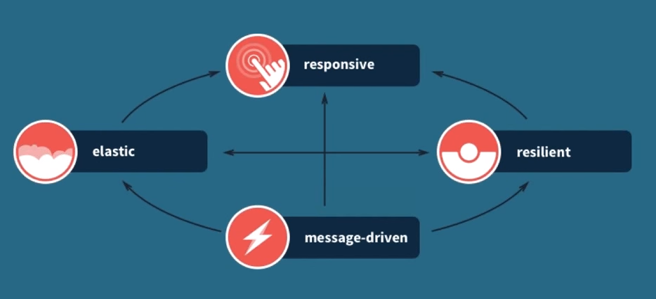

# Reactive Programming
### Building a modern distributed system

---

### Reactive Manifesto

---

Reactive Manifesto

<http://www.reactivemanifesto.org/>

---

### What makes an application "reactive"?

---



---

### Message-driven

---

- Loosely-coupled systems
- *Asynchronous* and *non-blocking* message passing
- *Immutable* state
- Concurrent by design
- Location transparency, local communication is an optimization, not conceptually different

---

### Resilient

---

- Failure is expected, part of the application's lifecycle
- Failure is *detected*, *isolated*, *managed*
- Allow for the application to self-heal
- Components never propagate failure
- *Replication* of all components

---

### Responsive

---

- Always available, *consistent* response times
- React to heavy load and failure

---

### Elastic

---

- *Leverage all resources* via asynchronous programming
- Cluster support allowing nodes/resources to join and leave
- Avoid shared resources and hence *contention*
- No central *bottlenecks*, allowing for replication and sharding of components

---

### Real-world

---

Walmart: (compared to old Oracle ATG system)

- 36% shorter page load times
- up to 50% savings in web-related infrastructure costs
- Faster development turnaround

---

Auvik:

- 1,500 LOC in Scala replaced 20,000 LOC of Java
- Custom type-safe DSL
- Automatic clustering, appliances are just cluster nodes

---

## Reactive Streams

---

"[...] standard for asynchronous stream processing with non-blocking back pressure"

---

4 Interfaces:
- Processor[T, R]
- Publisher[T]
- Subscriber[T]
- Subscription

---

Implementations by

- Akka
- RxJava
- Slick
- Vert.x
- ...

---

For more details,
<https://www.youtube.com/watch?v=jwnrZ4bK5hs>

(Roland Kuhn, Typesafe)

---

### A little bit of code
#### Mostly from the Akka docs

---

Actors are organized in a tree.

- /user/serviceA/worker1
- /user/serviceA/worker2

serviceA supervises its child actors

---

```scala
override val supervisorStrategy =
  OneForOneStrategy(maxNrOfRetries = 10, withinTimeRange = 1 minute) {
    case _: ArithmeticException      => Resume
    case _: NullPointerException     => Restart
    case _: IllegalArgumentException => Stop
    case _: Exception                => Escalate
  }
```

The parent decides what happens to a child actor upon failure

---

*ServiceA*

```scala

import akka.actor.{ Actor, Props }
import akka.actor.OneForOneStrategy
import akka.actor.SupervisorStrategy._
import scala.concurrent.duration._
import Worker._

final class ServiceA extends Actor {
  override val supervisorStrategy = OneForOneStrategy(maxNrOfRetries = 10, withinTimeRange = 1 minute) {
    case _ => Restart
  }

  override def preStart() {
    val worker = context.actorOf(Props[Worker], "worker")
    worker ! Die // Kill the worker
    worker ! DoWork(Vector(1, 2, 3)) // Revived worker will do work
  }

  def receive = {
    case Done => context.stop(self)
  }
}
```

---

*Worker*

```scala

import akka.actor.{ Actor, Props }

final class Worker extends Actor {
  import Worker._

  def receive = {
    case Die => throw new Exception()
    case DoWork(l) => ...; sender() ! Done
  }
}

object Worker {
  case class DoWork(elems: Vector[T])
  case object Die
  case object Done
}
```

---

*Scaling with routers*

```json

akka.actor.deployment {
  /serviceA/router1 {
    router = round-robin-pool
    nr-of-instances = 5
  }
}

```

```scala

val router1: ActorRef =
  context.actorOf(FromConfig.props(Props[Worker]), "router1")

```

---

*Routing in a cluster*

```json

akka.actor.deployment {
  /serviceA/workerRouter {
    router = consistent-hashing-group
    routees.paths = ["/user/worker"]
    cluster {
      enabled = on
      allow-local-routees = on
      use-role = compute
    }
  }
}

```

```scala

val workerRouter: ActorRef =
  context.actorOf(FromConfig.props(Props[StatsWorker]),
                   name = "workerRouter")

```
