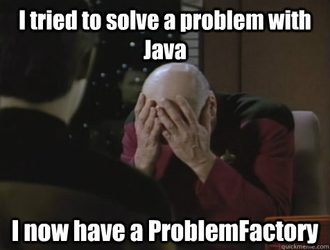

footer: © Tim Steinbach, 2016
slidenumbers: true

# Refined Types

#### [Tim Steinbach](http://nequissimus.com)

---

### Types

- Int
- String
- Char

---

### Problem statement

How do you ensure that a value is only a subset of all values allowed by its type?

- Int that is always < 5
- String that contains a valid regular expression
- Alphanumeric String

---

### Range checks (1)

```scala
class IntLess5(i: Int)
object IntLess5 { def apply(i: Int): Option[IntLess5] = Some(i).filter(_ < 5).map(new IntLess5(_)) }
```



---

### Range checks (2)

```scala
case class IntLess5(i: Int) {
    require(i < 5, "value is too large")
}
```


---

### Runtime (1)

- Object wrapper
- Functions Int => T no longer apply
- Composition?

---

### Runtime (2)

```scala
class IntLess5(i: Int) = { ... }
class IntLess10(i: Int) = { ... }

def ohno: IntLess10 = IntLess10(11) // Runtime exception!
def ohoh: IntLess10 = IntLess5(3) // Compile error!
```

---

### Refined types (1)

```scala
type IntLess5 = Int Refined Less[W.`5`.T]
type IntLess10 = Int Refined Less[W.`10`.T]
```

---

### Refined types (2)

- Purely runtime
- Type aliases, not actual types
- Checked using macros (essentially code run during compile time)

---

### Refined types (3)

```scala
val x: IntLess5 = 4
val y: IntLess10 = x
val z: IntLess5 = 6 // Compile error, type mismatch
```

---

### Runtime input (1)

```scala
val i: Int = restApi.get("/api/v1/foo")
// Now what?
```

---

### Runtime input (2)

```scala
val i: Int = restApi.get("/api/v1/foo")
val refined: Either[String, IntLess5] = refineV[IntLess5](i)

// Either is right-biased by convention
// will be Left("Predicate failed: (X < 5).")
// or Right(X)
```

---

### Runtime input (3)

- Push universal types to the outside of your application
- Pass refined types with strong guarantees around
- No need for most constaint-checking if expressions
- Allows for arbitrarily complex combinators, validation

---

### Ints are boring! (1)


---

### Ints are boring! (2)

```scala
val x = refineMV[AnyOf[Digit :: Letter :: Whitespace :: HNil]]('F')
x: Char Refined AnyOf[Digit :: Letter :: Whitespace :: HNil] = F

val r1: String Refined Regex = "(a|b)"
r1: String Refined Regex = (a|b)

val r2: String Refined Regex = "(a|b"
error: Regex predicate failed: Unclosed group near index 4

val u1: String Refined Url = "htp://example.com"
error: Url predicate failed: unknown protocol: htp

type ZeroToOne = Not[Less[W.`0.0`.T]] And Not[Greater[W.`1.0`.T]]
defined type alias ZeroToOne
```

---

### Benefits

```scala
val s: String = ???
val maybeUrlString: Either[String, String Refined Url] = refineV[String Refined Url](s)
val maybeUrl: Either[String, Url] = maybeUrlString.fold(
    left => Left(left),
    right => Right(new java.net.URL(right)) // This will always work, no runtime exceptions!
)
```

---

# Thank you


---

[Refined](https://github.com/fthomas/refined)
